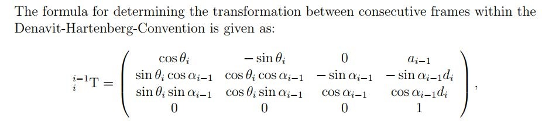
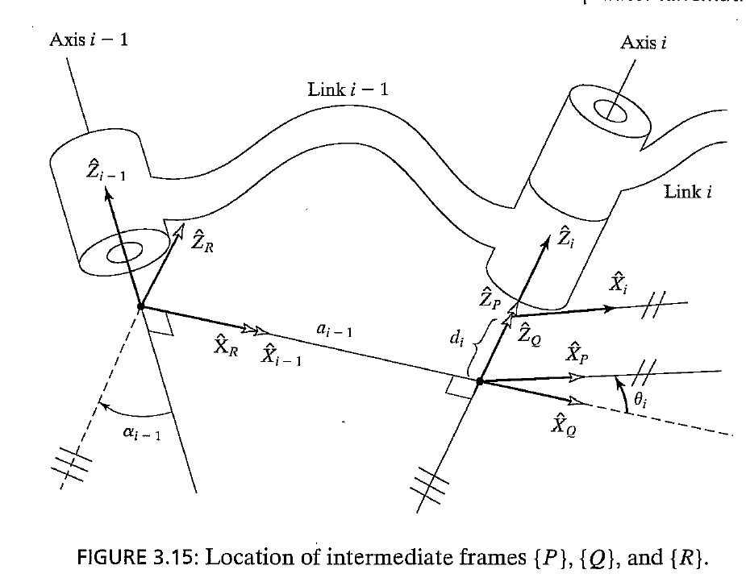
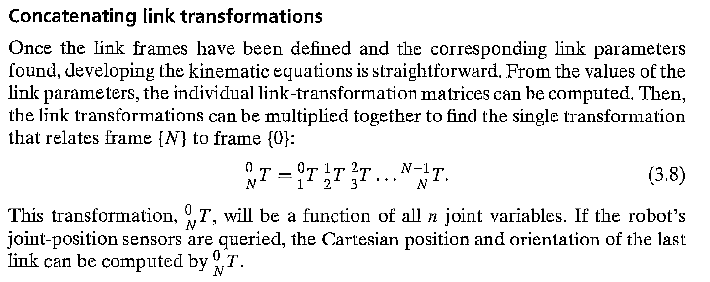

# Denavit–Hartenberg-calculator
 Script for calculating the DH-parameters (transformations) on a 4-link robot arm

## Description

This script is based on [Denavit–Hartenberg parameters](https://en.wikipedia.org/wiki/Denavit%E2%80%93Hartenberg_parameters). And for two adjacent links i and (i-1) on the robot arm, we have the coordinate transformation:

where the individual parameters are defined as

Note this image (and the image below) are taken from the book: Introduction to Robotics. Mechanics and Control. Third Edition. John J. Craig. PEARSON.

Therefore, if we need to get the transformation between last link (e.g. the gripper) and the first link, we need to concatenate the individual matrices:

However, the product cannot be computed by hand efficiently. With this small script, one is able to quickly get the result.

## Usage

Given some known real values and some unknown parameterized values, this script first lists the individual coordinate transformation between links i and (i-1) to make sure things go right; and calculates the overall transformation between links 1 and 4. In fact, an arbitrary transformation can also be calculated.

Follow the steps:

1. Adjust the parameters in the beginning of the script.
2. Adjust what you need as the result.
3. Run and get the result!

If you need to compute a 3-link or 5-link robot arm, you need to adjust the script accordingly. But the idea is the same:)

## A little more

Please note that the DH convention defined above is NOT possible to express arbitrary rigid body transformations. (No rotation around the y-axis is accounted for within the DH convention.)
